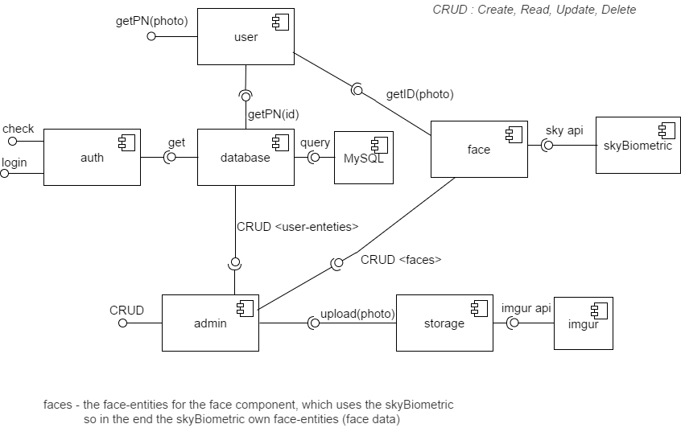
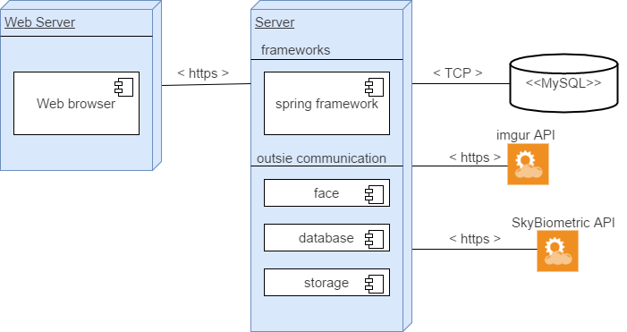

# Architecture Design
The subsystems of our system must be reusable and independent from each other, as that will make it easier to implement and test. The different subsystems or components are then combined by the application (which is our system). We define the different components in the component list, then we explain each of them briefly.

#### Component list
- authenticate
- admin
- user
- face
- database
- storage
- skyBiometry
- imgur
- MySQL

#### Component details
Now we will discuss why we need the different components, how they will be used and what they will require.
##### 1. authentication
The authentication component is required for security and divides the system based on whether the connected client is an user or an admin. The required interface for authentication is the database component, the provided interface is a login functionality that returns an integer 0 - no match, 1 - user and 2 - admin and a check which checks if current client is logged in (user or admin).

##### 2. admin
The admin component is a core component that will hold all the admin responsibilities which is management of client users (faces). The required interface is the face, storage and database component. The provided interface is the CRUD methods.
- CREATE  : create a new user
- READ    : get the user information by id or all.
- UPDATE  : updates an existing user by id
- DELETE  : removes an existing user by id

##### 4. user
The user component is also a core component that will be responsible of getting a Swedish social security number based on a image. The required interface is the face, database and the provided interface is "*uploading a picture*"

##### 4. face
The face is the main component of this system (FRS), this needs to be as independent as possible in order of our system to be adaptive to changes (i.e. face-recognition algorithm may be replaced in the future for a better one). The required interface that is needed is skyBiometry (the face-recognition api) and the provided interface is CRUD methods which allows admins to manage client faces as well as letting user component get a PN based on a picture.

##### 5. database
The database or actually database-access component is the component that will directly talk with the remote database. The required interface is MYSQL-database and the provided is CRUD methods and a login method.

##### 6. storage
The storage component is the component that will save the client-face picture to the storage, now we will use imgur.com api to store pictures as space is an issue but in future this can be changed into storing images directly in our server. The required interface is imgur.com-api and the provided interface is upload picture.  

##### 7. skyBiometry
The face-recognition algorithm api, we will use skyBiometry as discussed earlier.

##### 8. imgur
The imgur or imgur.com-api will be used by our storage component.

##### 9. MySQL
MySQL is the database type we will use by the database-access component.

#### Architecture Pattern
We want good reusability, good cohesion, low coupling, abstraction and portability all this because components should be easily changeable, independent so development can be as well and portable so the system can easily be changed to other servers (in the future). Our system is a layer type where the application (which will act as the glue code) will use authentication, admin and user component and these will use the others. See the component diagram to clearly see why it will be a layered system. Since our system will only be a server the client-server pattern can be excluded. The patterns that meets our required types i.e. cohesion, coupling, abstraction and portability is:
- Multi-layers
- Service-oriented

The Service-oriented pattern focus on the communication between the different web-services, in our case is with MySQL database, imgur.com api and skyBiometry. This will use standard communication HTTP which in the core basics is XML as the pattern says it should be (open standards). This is a very good pattern to follow when it comes to our remote components.

The Multi-layers pattern focus on how the communication should be, i.e. layer can only speak with the layer below it, in our case the different components can only speak with the required components and not the other way around (see component diagram to better understand). This is also a very good pattern for our system that focuses on the structure of the system.

##### Conclusion
We will use a combined pattern, Multi-layers pattern (for developed component) and Service-oriented pattern (for communication with remote components).

### Diagrams
#### Component Diagram

#### Deployment Diagram

